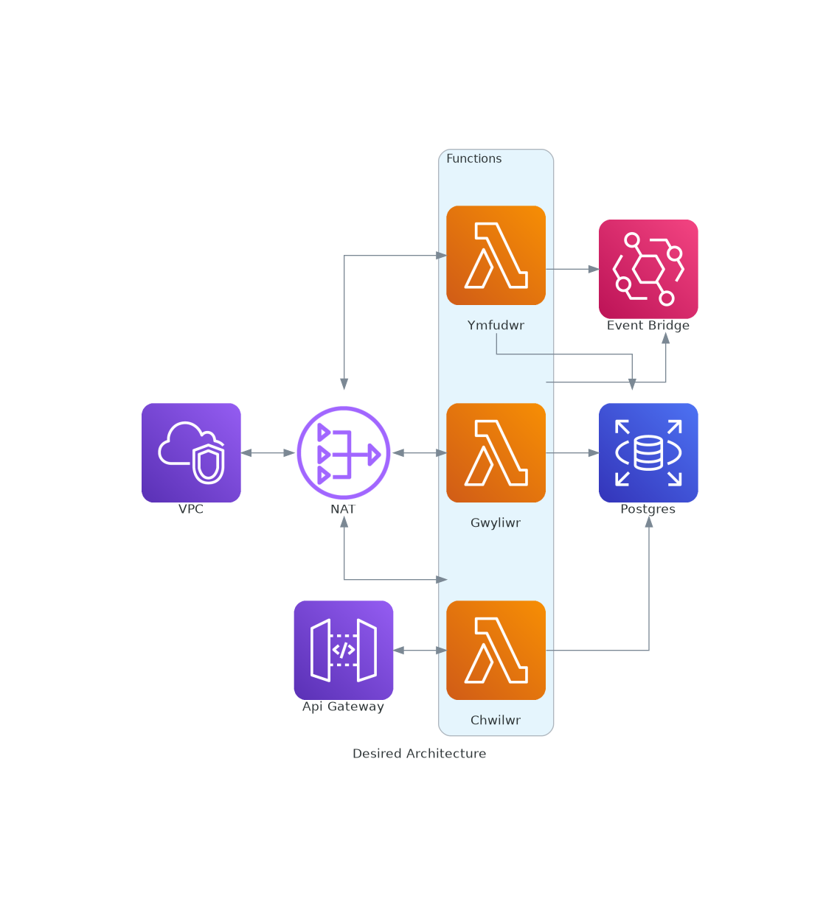

# Overview

This is a micro service based application for monitoring, collecting, and displaying long-term stats for Dub packages.

## Why micro services?

Because I needed practice with deploying a micro service application.

## Why Go instead of D?

Because Go is one of **the** languages for DevOps, so it's more important for me to learn and use than D.

## Why are the names in Welsh?

Because I wanted to give my stalkers a nice confusing surprise :)

* Ystadegau (uh-stah-deh-gah) means "Statistics"
* Gwyliwr (goo-lee-uhruh) (Welsh 'r' is rolled and pronounced, hence the "ruh" as an approximation) means "Watcher"
* Ymfudwr (um-vuh-duhruh) means "Migrator"
* Ymfudiadau (um-vuh-dee-ah-dah) means "Migrations"

... I think that's correct at least. Still not 100% sure if a leading "u" is pronounced or not.

I kind of wanted to use Japanese, but I don't even know how to get a Japanese input thing on Linux, let alone the pain of having
to constantly switch into it when debugging O.O

## What's the overall architecture?

Well, if I had money I'd do things "properly" and go with a lambda based approach looking like this:

However I don't have money and didn't want to pay $30/month for a NAT just so my lambda functions could talk to the internet and my
private RDS instance at the same time, so instead it looks like this:

It's super weird to me that a NAT gateway is so costly. AWS so far has been super flexible with pricing, but NAT gateways are just way too out there.